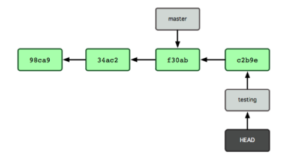

### Autor: Álvaro Pereira
### Resumen GitHub
 

# Git
***Git*** es un sistema de control de *versiones* distribuido creado por **Linus Torvalds**. Desde su nacimiento
en 2005, ha evolucionado y madurado para ser **fácil de usar**, conservando su velocidad y eficiencia
en grandes proyectos. Además, tiene un increíble sistema de ramas ***(branching)*** para el desarrollo no
lineal.

> La principal diferencia entre *Git* y cualquier otro *VCS* (Subversion y compañía incluidos) es cómo Git
**modela** sus **datos**. *Conceptualmente*, la mayoría de los demás sistemas almacenan la información
como una lista de cambios en los archivos. **Estos sistemas** (CVS, Subversion, Perforce, Bazaar, etc.)
modelan la información que almacenan como un conjunto de archivos y las modificaciones hechas
sobre cada uno de ellos a lo **largo del tiempo**.

>> Al crear una ***nueva rama*** siempre se *clona* la rama en la que estamos **actualmente**.
Esto es muy útil si, por ejemplo, se quieren añadir nuevas *funcionalidades* al proyecto sin
que interfieran con lo *desarrollado* hasta ahora. Cuando se termina el desarrollo de las
nuevas funcionalidades las ramas se pueden ***fusionar*** para incorporar lo cambios al
proyecto principal. De esta manera siempre podemos *asegurar* que nuestro proyecto está
en perfectas **condiciones**.
 

## Comandos básicos de git
> 1. Creación repositorio local
>> - git *init*
> 2. Estado de un repositorio
>> - git *status
> 3. Añadir archivo a la **stagin area**
>> - git add *nombre-archivo*
> 4. Mover archivos al **repositorio**
>> - git commit -b *"comentario"*
> 5. Saltarse el staging area
>> - git commit -a -m *"comentario"*
> 6. Consultar el historial de commits
>> - git log --oneline
> 7. Mover un archivo del staging area al **workspace**
>> - git reset HEAD *archivo*
> 8. Deshacer cambios en el **workspace**
>> - git checkout -- *archivo*
> 9. Crear una etiqueta
>> - git tag -a *nombre-etiqueta* -m *mensaje-etiqueta*

  

# Git Avanzado
Aquí empieza una de las partes más potentes que tiene Git y es el uso de **ramas** para el
**trabajo compartido**. Una de las característica más útiles de Git es que permite la creación
de ramas para trabajar en **distintas versiones de un proyecto** a la vez.

> Inicialmente cualquier *repositorio* tiene una única rama llamada master donde se van
sucediendo todos los commits de manera *lineal*. Al comenzar un proyecto debemos crear
una nueva rama con el objetivo de dejar la rama principal *(master)* lo más estable posible.

>> Al crear una ***nueva rama*** siempre se *clona* la rama en la que estamos **actualmente**.
Esto es muy útil si, por ejemplo, se quieren añadir nuevas *funcionalidades* al proyecto sin
que interfieran con lo *desarrollado* hasta ahora. Cuando se termina el desarrollo de las
nuevas funcionalidades las ramas se pueden ***fusionar*** para incorporar lo cambios al
proyecto principal. De esta manera siempre podemos *asegurar* que nuestro proyecto está
en perfectas **condiciones**.
 

## Comandos creacion de ramas
> 1. Creacion de ramas
>> - git branch *rama*
> 2. Listado de ramas
>> - git *branch* 
> 3. Cambio de ramas
>> - git branch *rama*
>> - git checkout *rama*
>> - git checkout -b *rama*
> 4. Eliminar ramas
>> - git branch -d *rama*
>> - git branch -D *rama*
> 5. Fusionar ramas
>> - git merge *rama*
 

 

# GitHub
**GitHub** es una compañía sin *fines de lucro* que ofrece un servicio de hosting de
repositorios almacenados en la nube. ***Esencialmente***, es una plataforma de desarrollo
colaborativo para alojar y gestionar proyectos utilizando el *VCS Git*.

## Comandos creacion de ramas
> 1. Clonar un repositorio remoto
>> - git clone *url-repositorio *
> 2. Añadir un repositorio remoto
>> - git remote add *repositorio-remoto* *url* 
> 3. Descargar cambios de un repositorio remoto
>> - git pull *remoto* *rama*
>> - git fetch *remoto* *rama* ***(no integra la última versión)***
> 4. Subir cambios de un repositorio remoto
>> - git push *remoto* *rama*
> 5. Eliminar sincronización con un repositorio remoto
>> - git remote remove *nombre*
> 6. Subir etiquetas a un repositorio remoto
>> - git push origin *nombre-etiqueta*

 

### Mas información
Enlances de interés:
> [Pull request tutorial](https://www.freecodecamp.org/espanol/news/como-hacer-tu-primer-pull-request-en-github/) 

> [Markdown syntax](https://www.markdownguide.org/basic-syntax/) 
 

> [Tutorial GitHub](https://docs.github.com/en/get-started/quickstart/hello-world)